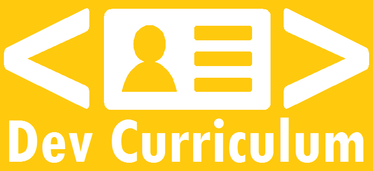

    

# Dev Curriculum

> Instant web curriculum generator for developers

## What is this?

**Dev Curriculum** is the fastest and simplest way to make a web curriculum for developers.  

In few minutes you can have your own **Web Curriculum** for free using **Dev Curriculum** and **Github Pages**.

#### What is a web curriculum?

It's the reduced version of a **Curriculum Vitae**, but made as a web page.

## Who this is made for?

Any developer that doesn't have a **Web Curriculum**.

## How it will look like?

I ain't just developed **Dev Curriculum**, I'm also using it as my own Web Curriculum and you can check a demo **[here](http://wendelladriel.github.io)**.

## How to use

First of all make sure you have ruby installed and bundle as well, if not, have refer to the the ruby official website at [ruby.com](https://www.ruby-lang.org/en/documentation/installation/) and bundle official website at [bundler.io](http://bundler.io)

Once you have all environment set up done go ahead and follow the steps below:

#### Step 1 - Fork Dev Curriculum to your User Repository

Fork this repository, then rename the repository to `your-github-username.github.io`. Example: `wendelladriel.github.io`.  In order to rename, go to you forked repository and click in settings

At this moment the **Web Curriculum** will often be viewable immediately at http://your-github-username.github.io. But you may need do some changes to make you curriculum as you wish.

#### Step 2 - Customize your Web Curriculum

To customize your **Web Curriculum** you will change only two files:  
- `_config.yml`: in this file you have to put your personal informations and skills list
- `css/_variables.sass`: in this file you can change the colors to customize the appearance of your **Web Curriculum**

#### Step 3 - Publish your Web Curriculum

obs: In this stage you can edit your files on the fly by github interface, or if you prefer locally as well.

After you made the changes, just `commit` and `push` to your repository and your **Web Curriculum** is ready, just go to http://your-github-username.github.io and see your new awesome **Web Curriculum**!!!

## Contributing

Bug reports and pull requests are welcome on GitHub at https://github.com/WendellAdriel/dev-curriculum/. This project is intended to be a safe, welcoming space for collaboration, and contributors are expected to adhere to the [Contributor Covenant](http://contributor-covenant.org) code of conduct.

## License

The theme is available as open source under the terms of the [MIT License](http://opensource.org/licenses/MIT).

    

